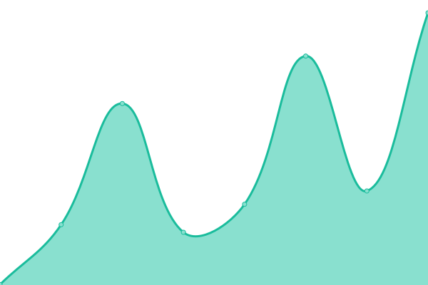
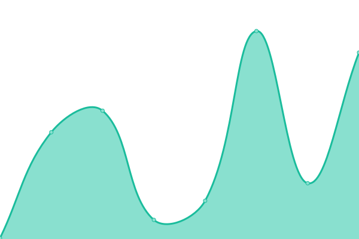

# [📈 Live Status](https://status.sensolabs.cl): <!--live status--> **Todos los sistemas están operativos**

This repository contains the open-source uptime monitor and status page for [Sensolabs SpA](https://status.sensolabs.cl), powered by [Upptime](https://github.com/upptime/upptime).

With [Upptime](https://upptime.js.org), you can get your own unlimited and free uptime monitor and status page, powered entirely by a GitHub repository. We use [Issues](https://github.com/sensolabs/status/issues) as incident reports, [Actions](https://github.com/sensolabs/status/actions) as uptime monitors, and [Pages](https://status.sensolabs.cl) for the status page.

<!--start: status pages-->
<!-- This summary is generated by Upptime (https://github.com/upptime/upptime) -->
<!-- Do not edit this manually, your changes will be overwritten -->
<!-- prettier-ignore -->
| URL | Status | History | Response Time | Uptime |
| --- | ------ | ------- | ------------- | ------ |
|  [Website](https://sensolabs.cl) | En linea | [website.yml](https://github.com/sensolabs/status/commits/HEAD/history/website.yml) | 

 1306ms
     
 | 

<a href="https://status.sensolabs.cl/history/website">100.00%</a>
    

|  [UnaCola App](https://1-cola.cl) | En linea | [una-cola-app.yml](https://github.com/sensolabs/status/commits/HEAD/history/una-cola-app.yml) | 

 302ms
     
 | 

<a href="https://status.sensolabs.cl/history/una-cola-app">100.00%</a>
    

|  [Sensolink](https://sensol.ink) | En linea | [sensolink.yml](https://github.com/sensolabs/status/commits/HEAD/history/sensolink.yml) | 

 535ms
     
 | 

<a href="https://status.sensolabs.cl/history/sensolink">100.00%</a>
    

|  [Sensolink API](https://api.sensol.ink) | En linea | [sensolink-api.yml](https://github.com/sensolabs/status/commits/HEAD/history/sensolink-api.yml) | 

 197ms
     
 | 

<a href="https://status.sensolabs.cl/history/sensolink-api">100.00%</a>
    

<!--end: status pages-->

[**Visit our status website →**](https://status.sensolabs.cl)

## 📄 License

- Powered by: [Upptime](https://github.com/upptime/upptime)
- Code: [MIT](./LICENSE) © [Sensolabs SpA](https://status.sensolabs.cl)
- Data in the `./history` directory: [Open Database License](https://opendatacommons.org/licenses/odbl/1-0/)
